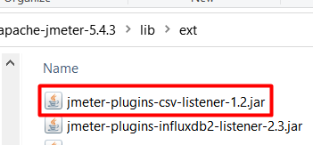

# JMeter CSV listener plugin

  

<h3> 

Support my Ukrainian Family 

 

</h3> 

<h3>

Like what you see?

 
   

</h3>

## Description
The goal of the project is to save data to CSV like file with detailed information for the debugging purposes. In the CSV file you can expect to see time of the event with the following.

The details of the request:
* Name;
* URL;
* Headers;
* Request data.

The details of the response:
* Code;
* Response time;
* Headers;	
* Body;
* Assertion message. 

Click [here](https://minhaskamal.github.io/DownGit/#/home?url=https://github.com/mderevyankoaqa/jmeter-csv-listener-plugin/tree/main/samplers/ExtraLogs.csv) to see an example of the result CSV file.
  
So in the result of the test its possible to have the standard JMeter HTML report and CSV like file with failed or failed/successful requests details.

## Compatibility
The supported versions:
* Java 11 - make sure that you have it (its minimum version).
* JMeter 5.4.3 only.

## Maven Support
Please see the latest release here https://search.maven.org/artifact/io.github.mderevyankoaqa/jmeter-plugins-csv-listener.

## CI/CD Support
The CI/CD can be done using [jmeter-maven-plugin](https://github.com/jmeter-maven-plugin/jmeter-maven-plugin)
The example of the adding plugin to the project with the jmeter-maven:

          <configuration>
                <jmeterExtensions>
                  <artifact>io.github.mderevyankoaqa:jmeter-plugins-csv-listener:1.2</artifact>
                </jmeterExtensions>
            </configuration>
Some notes cab be found in the article [Adding jar's to the /lib/ext directory](https://github.com/jmeter-maven-plugin/jmeter-maven-plugin/wiki/Adding-Excluding-libraries-to-from-the-classpath).

## Deployment
* Put `jmeter-plugin-csv-listener-<version>-all.jar` file from [Releases](https://github.com/mderevyankoaqa/jmeter-csv-listener-plugin/releases) to `~<JmeterPath<\lib\ext`;

  Note: "jar" (recommended) or "shadowJar" gradle tasks can be used to create the package for the JMeter.
  
  

* Run JMeter and select the test plan, Add-> Listener -> Backend Listener.

  

* Select from the dropdown item with the name '`io.github.mderevyankoaqa.csv.results.writer.CsvBackendListenerClient`'.

  

## Plugin configuration

  

Let’s explain the plugin fields:
* `filePath` - the path to save the recorded data. 
  Notes: Can be set like this `${__P(errorLogsPath, ${__BeanShell(import org.apache.jmeter.services.FileServer; FileServer.getFileServer().getBaseDir();)}/ExtraLogs.csv)}` - allows JMeter generates the file near executed jmx.
* `timeZoneId` - the time zone Id to save the time in the specific time zone, the default is UTC; the full list of the supported zones here - https://en.wikipedia.org/wiki/List_of_tz_database_time_zones, the column "TZ database name".
* `timeFormat` - the format to save the event id.
* `csvSeparator` - the separator between the words; the default is "|". Since the requests, and the responses may have chars like this "," or ";" that way the not standard delimiter has been used.
* `isRecordSubSamplers` - allows to save the JMeter sub samples if set to 'true'.
* `isRecordSuccessfulResults` - allows to record the successful results. For example this option can be used to store the data from the functional tests. 
* `isUseRegexForSamplerList` - allows to use the regexps if set to 'true'.
* `batchSize` - the max size of the batch with metrics, the default 2000 (2000 items of JMeter results).
* `flushInterval` - its interval to save data on the disc, the default value is 10000 (10 seconds).

## Sending metrics performance tuning
The plugin writes batch with JMeter results each 10 seconds (by default settings). In the logs you will see records like this:
`INFO o.m.j.c.r.w.CsvBackendListenerClient: Data has been written successfully, batch with size is --> 8, elapsed time is --> 2 ms
` (the elapsed time is the response time of the batch importing.) So you can control the flush interval depends on the load you have and adjust `influxDBFlushInterval` setting. Is not recommended having less 1 second.  
Max batch protection -> send data when batch max size is occurred. For example, when batch size is 2000 items (it's the default setting of `batchSize`) plugin writes that batch, even when flush interval was not occurred.
Using both options you can tune data writing and have optimal performance.

Make sure you have enough ram to aggregate huge batch and optimal flush period.

## Recommendations
There are capabilities to save all data (request/response) - when the option `isRecordSuccessfulResults` is set to `true` (the default value is `false`) - this combination can be used only for the functional tests.
The certain idea is to save only failed responses while the load test and then address to the development team the list with failures (in this case we need to set the option `isRecordSuccessfulResults` to `false`). So in the result of the test its possible to have the standard JMeter HTML report and CSV like file with failed requests.
The output can be used to save data to ELK stack as well.
